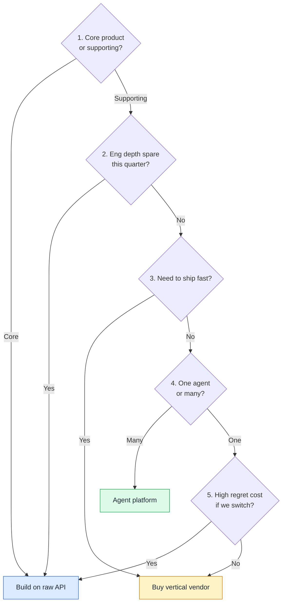

# Decision Log — Agent Platform vs Raw Foundation API

**Date:** *(month + year of decision)*
**Status:** Decided
**Decision owner:** PM with cross-team scope

## Context

A team needed to ship several AI features in a single planning cycle. The features ranged across abstraction levels: one was a conversational agent (high autonomy, multi-turn, complex tool use); another was a structured-output pipeline (single turn, deterministic, narrow); another was a small workflow agent triggered by an event, not a chat.

The same foundation models could power all of them. The question wasn't which model. It was which abstraction layer to build on.

Three real options.

## Options considered

### Option A — Raw foundation-model APIs

Direct integration with the model provider's API. Own orchestration, prompts, evals, observability, and production reliability ourselves.

- **Pros:** Maximum control. No abstraction lock-in. Best long-term unit economics. Right for features that *are* the core product.
- **Cons:** Slowest to first launch. Requires sustained engineering attention on orchestration and observability indefinitely. Production reliability sits squarely on us. The team becomes responsible for building tooling that already exists elsewhere.
- **What it would have cost:** ~12–16 weeks of engineering per feature. Ongoing eval and reliability work after launch. Real schedule risk.

### Option B — An agent platform

A third-party platform that handles orchestration, simulation, observability, governance. We bring use cases, prompts, and tools.

- **Pros:** Faster than raw build. Shared production layer across multiple agents the team will ship. Built-in versioning, traces, eval harness — work we'd otherwise build ourselves.
- **Cons:** Newer category. Platform-shaped thinking is a trap — see [Anti-pattern: Platform-as-spec](../frameworks/ai-agent-product-spec.md#anti-patterns). Migration cost if the platform stops matching needs.
- **What it would have cost:** Platform fees. Learning curve. Accepting the platform's defaults as the starting point of agent design.

### Option C — A vertical AI vendor

A domain-specific SaaS that solves one feature category end-to-end. Plug in, configure, ship.

- **Pros:** Fastest to first launch. Vendor owns reliability and updates. Domain features (channel integrations, compliance) come for free.
- **Cons:** Per-feature lock-in × N features. Vendor sprawl. No cross-feature consistency in voice, governance, or data ownership. Vendor risk on each one (pivot, shutdown, price changes).
- **What it would have cost:** Procurement effort × N. Per-call or per-seat fees scaling with usage. Vendor management overhead.

## Decision

A **hybrid**: vertical vendor for one well-understood domain with strong existing channel integrations, agent platform for everything else. **No raw API in this cycle.**

The dominant reason: the well-understood domain had a category leader whose channel integrations would have taken us a year to rebuild. Everything else benefited from a shared production layer across multiple agents — the same eval harness, the same observability, the same versioning, applied across the portfolio.

We deferred the raw API path to v2. The launch dates didn't allow it.

## What we gave up

- **Long-term unit economics.** Raw API at scale is cheaper. We accepted higher near-term cost for faster time-to-launch.
- **Maximum customization.** The platform has defaults we'd have made differently. We accepted defaults to ship.
- **A clean single-vendor story.** We now have two AI vendors plus the foundation-model provider underneath them. Real surface area to manage.

## What would change our mind

- **Platform pricing scales worse than projected as usage grows** → revisit raw API for the highest-volume agents.
- **The vertical vendor's pace slows materially relative to alternatives** → reopen procurement.
- **The team's agent design competency outgrows the platform's ceiling** → migrate the deepest agents to raw API, keep the rest.

## The reusable lens

For any future AI-feature build-vs-buy decision, ask five questions in order:

1. **Is this feature the core product, or supporting infrastructure?**
   - Core gets more build. Supporting gets more buy.

2. **Do we have the engineering depth to own the production layer?**
   - Not *"can we hire."* Not *"have we hired."* *Do we have it spare this quarter?*

3. **How fast does this need to ship?**
   - Faster needs = more buy. Slower runways allow more build.

4. **Is this one agent or the first of many?**
   - Many agents argue for a shared production layer (a platform). One agent argues for whichever is cheapest to ship.

5. **What's our regret cost if we have to switch later?**
   - Specific: if we have to migrate off this layer in 18 months, how much work do we throw away? If the answer is "weeks," buy. If "quarters," build more carefully.

If the answers don't all point one direction — they rarely will — **hybrid is usually right**. Don't force a clean story for narrative reasons.

*The tree is a guide, not a verdict. Most real decisions land in the middle — which is why the hybrid answer is so common.*

## What happened next

*(Fill in 3–6 months post-launch with the metric that decided whether the call held up. Likely candidates: platform fees as % of compute spend, time-from-spec-to-production per agent, number of agents on the shared production layer.)*
