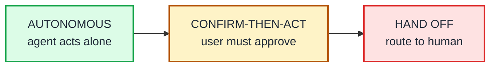
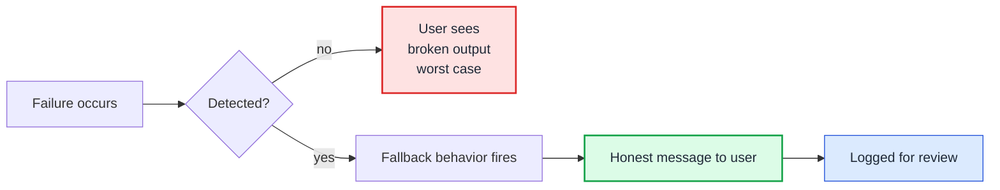

# Agent Product Spec — Template

*Clone this file. Fill in each section for your agent. The framework that explains why each section exists is [here](./ai-agent-product-spec.md).*

---

## How to fill this (don't go in order)

The sections are numbered 1–7 for the reader. They are not the order you fill them in. Fill in this order — anchor first, exit second, scoring third, then the middle.

```mermaid
flowchart LR
    S1["1. Job to be Done<br/><i>anchor</i>"] --> S7["7. Sunset Criteria<br/><i>exit</i>"]
    S7 --> S5["5. Evaluation<br/><i>scoring</i>"]
    S5 --> S2["2. I/O Contract"]
    S2 --> S3["3. Decision Boundary"]
    S3 --> S4["4. Failure Modes"]
    S4 --> S6["6. Governance<br/><i>last</i>"]

    style S1 fill:#dbeafe,stroke:#1d4ed8,stroke-width:3px,color:#1f2937
    style S7 fill:#fee2e2,stroke:#dc2626,stroke-width:3px,color:#1f2937
    style S5 fill:#fef3c7,stroke:#b45309,stroke-width:3px,color:#1f2937
    style S2 fill:#f3f4f6,stroke:#6b7280,color:#1f2937
    style S3 fill:#f3f4f6,stroke:#6b7280,color:#1f2937
    style S4 fill:#f3f4f6,stroke:#6b7280,color:#1f2937
    style S6 fill:#f3f4f6,stroke:#6b7280,color:#1f2937
```

*If you can't write Section 1, stop. If you can't write Section 7, you don't yet know why this agent should exist.*

---

## Identity

- **Agent name:**
- **Version:** v1.0
- **PM (owner):**
- **Eval owner** *(single person, not a team):*
- **Date written:**
- **Next review date** *(set 90 days from today):*

---

## Section 1. Job to be Done

*The **user's** job, not the agent's task. One sentence with a specific outcome.*

> The user is trying to ______________ within ______________ without ______________.

**Success threshold for this job:**

> ______________

*(If you can't fill in Section 1 in a single sentence everyone in the room would write the same way, stop. The rest of the spec will rot.)*

---

## Section 2. Input/Output Contract

*Be concrete. "Natural language" is not an input spec. "A helpful answer" is not an output spec.*

**Input the agent receives**

- Format *(plain text / structured JSON / tool output / multi-modal):*
- Source *(direct user message / upstream API / event trigger / scheduled run):*
- Required fields:
- Optional fields:

**Output the agent produces**

- Response to the user *(format + tone):*
- Side effects *(systems it writes to, messages it sends, workflows it triggers):*
- Output schema *(if structured — paste or link to the schema):*

**Out of scope**

- Inputs the agent should refuse *(and the refusal message it uses):*
- Inputs the agent should hand off *(and to whom):*

---

## Section 3. Decision Boundary

*Every action the agent can take sits in one of three zones. Place each one explicitly. Anything you don't place will default to the most dangerous zone.*

**Autonomous actions** *(no confirmation needed)*

- Action:
- Action:

**Confirm-then-act actions** *(user must approve before action)*

- Action *(and the exact confirmation prompt the user sees):*
- Action:

**Hand-off triggers** *(conditions under which the agent defers to a human)*

- Trigger *(and who the conversation routes to):*
- Trigger:

**The handoff sentence — exact wording:**

> ______________

*(Don't leave this to the model. Write the words.)*

---

## Section 4. Failure Modes & Graceful Degradation

*For every failure mode, you owe the user three things: detection, fallback, and a sentence that tells them what just happened. Silence is the worst failure mode.*

| Failure mode | Signal that this is happening | Fallback behavior | What the user sees |
|---|---|---|---|
| Tool call fails |  |  |  |
| Model uncertainty |  |  |  |
| User hostility |  |  |  |
| Out-of-scope request |  |  |  |
| Hallucinated policy |  |  |  |

*(Add rows for any agent-specific failure modes.)*

---

## Section 5. Evaluation Criteria

**Offline eval suite** *(fixed test cases, run before any prompt or model change ships):*

- Suite location:
- Number of test cases at launch:
- Owner *(single person, named above in Identity)*:

**Online eval / outcome metrics tied to Section 1:**

- Metric 1:
- Metric 2:
- Metric 3:

**Regression bar** *(minimum score a prompt change must maintain to ship):*

> ______________

---

## Section 6. Governance

| Activity | Owner | Reviewer | Cadence |
|---|---|---|---|
| Edit system prompt |  |  |  |
| Approve prompt changes |  |  |  |
| Swap model |  |  |  |
| Edit eval suite |  |  |  |
| Incident response |  |  |  |

**Logged events** *(what's logged, where, retention):*

-

---

## Section 7. Sunset Criteria

This agent will be retired if any of the following are true:

- [ ] *(metric ___ stays below ___ for ___ consecutive ___)*
- [ ] *(escalation rate climbs above ___)*
- [ ] *(a regulatory or business change makes the use case untenable)*
- [ ] *(the underlying user job in Section 1 no longer applies)*

*(If you cannot write a single condition here, write one anyway. "We will review the agent's value in 12 months and decide whether to keep it" is a sunset criterion.)*

---

## Change log

| Date | Section changed | What changed | Reason |
|---|---|---|---|
|  |  |  |  |

---

## Implementation Notes (Stack)

*This appendix documents the current implementation and is updated whenever the stack changes. It does **not** change the product spec above — but it must stay in sync with reality. The product spec is model-agnostic and platform-agnostic; the implementation is not.*

### Model & provider

- **Provider** *(OpenAI / Anthropic / Google / AWS Bedrock / Perplexity / Groq / Mistral / other):*
- **Model:**
- **Why this choice** *(cost / latency / capability — one line):*
- **Fallback model** *(if any):*
- **Migration cost** *(easy / medium / hard to swap providers):*

### Tools registered

| Tool | What it does | Failure-mode mapping (Section 4) |
|---|---|---|
|  |  |  |
|  |  |  |

### Memory design

- **Short-term** *(conversation history within session — keep N messages / full session):*
- **Long-term** *(cross-session — what gets persisted, by whom):*
- **Scoping** *(per user / per agent / per session):*
- **Retention policy** *(how long, who can purge):*

### Guardrails

- **PII detection** *(which types — emails, credit cards, names, addresses — and action: redact / block / flag):*
- **Toxicity threshold** *(numeric + action on breach):*
- **Content policy filters** *(domain-specific filters — legal, medical, regulated industries):*
- **Out-of-scope routing** *(what happens when asked something outside Section 1):*

### Observability

- **Events emitted** *(start / thinking / tool_call / llm_generation / completed / error):*
- **Trace store** *(where the events go — what system, what retention):*
- **Session correlation** *(how `session_id` is generated and propagated):*
- **Cost monitoring** *(token tracking, alert thresholds):*

### Cost budget

- **Token budget per run** *(target / hard cap):*
- **Monthly cost ceiling** *(target / alert threshold):*

### Knowledge layer *(if applicable)*

- **RAG / semantic search corpus** *(what documents, how indexed):*
- **Knowledge graph** *(entities and relationships, if used):*
- **Refresh policy** *(how often the knowledge layer is updated):*

---

*This template is the structural form of the [Agent Product Spec framework](./ai-agent-product-spec.md). Fill it in with the PM, the engineering lead, and the named eval owner in the same room. Lock the answers. Put the next review on the calendar before anyone leaves.*
