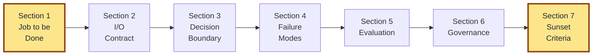
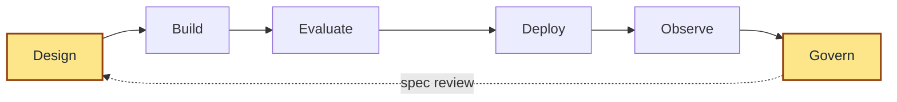
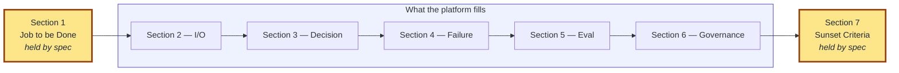
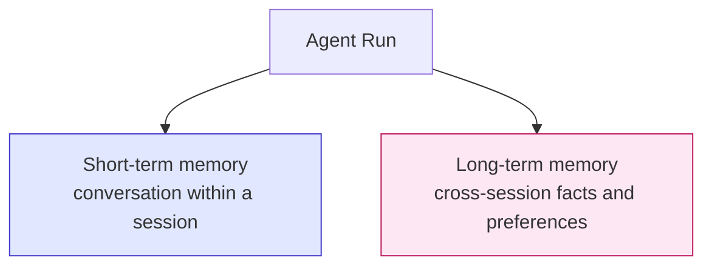
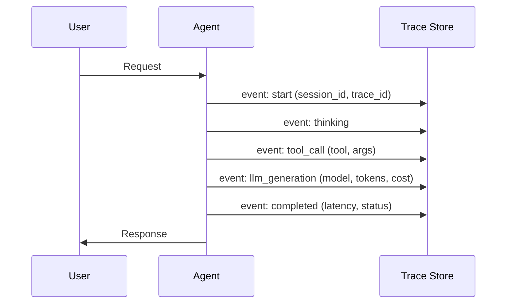

# Specifying an AI Agent as a Product, Not a Prompt

**Problem this solves:** Most "AI agent specs" online are technical prompt-engineering docs. They tell you how to make the model behave. They don't tell you whether the agent is a *product* — whether it has a real job, a real user, real failure handling, and a real way to be evaluated, governed, and sunset.

**The unlock:** An AI agent is a product. Spec it like one. The prompt is implementation.

**For:** The PM who got handed an AI feature and is staring at a prompt template wondering where the actual product work is.

---

## The seven-part agent product spec

*Sections 1 and 7 — the bookends — are the ones no agent platform asks for. They're also the ones teams skip first. The five in the middle are filled by the platform; the bookends are held by the spec.*

### 1. Job to be done

What's the *user's* job? Not "the agent answers questions." That's the agent's job. The user's job is something like *"draft three reply options for this customer email in thirty seconds, in my voice, so I can pick one and send without rewriting it."*

If you can't name the user's job in a single sentence with a specific outcome, stop. The rest of the spec will rot.

### 2. Input/output contract

What goes in, what comes out, in what shape.

- **Input:** user message, plus what context the agent has (user history, account state, tool access)
- **Output:** the response, plus structured side effects (tickets created, statuses updated, escalations triggered)
- **Out of scope:** the inputs the agent should explicitly refuse or hand off

This is the most-skipped section in real-world specs. It's also the section that catches 80% of integration bugs.

### 3. Decision boundary

Where does the agent decide vs. where does it defer to a human or another system?

Three categories:

- **Autonomous** — agent acts without confirmation (e.g. answering an FAQ)
- **Confirm-then-act** — agent proposes, user confirms (e.g. cancelling a subscription)
- **Hand off** — agent recognizes it shouldn't proceed and routes elsewhere (e.g. legal threats, mental health crises)

Draw the boundary explicitly. The default of "let the agent decide" is how products get into the news for the wrong reasons.

### 4. Failure modes & graceful degradation

What does the agent do when it doesn't know? When the tool call fails? When the user is hostile? When the LLM hallucinates a policy that doesn't exist?

For each mode, name:
- The signal that this failure is happening
- The fallback behaviour
- Whether and how the user is told

"Graceful degradation" is not a slogan. It's a list of explicit fallbacks.

### 5. Evaluation criteria

Two layers:

- **Offline eval** — a fixed test suite (real or synthetic) the agent must pass before any prompt or model change ships. Treat this like CI for the agent. If you don't have one, your "improvements" are vibes.
- **Online eval** — live metrics tied to the job-to-be-done (resolution rate, escalation rate, time-to-resolution, downstream NPS). Not generic "agent satisfaction" — outcome metrics.

If your agent has no offline eval and the team is "iterating on the prompt," you're not iterating. You're guessing.

### 6. Governance

Who can change what, and how?

- Who can edit the system prompt?
- Who reviews prompt changes before they ship?
- Who decides when to swap models?
- Who owns the offline eval suite and approves changes to it?
- What's logged, where, and for how long?

In small orgs this is "the PM and a senior engineer." In larger orgs it's a full RACI. Either way, write it down. The first time you have an incident, this section is what saves you.

### 7. Sunset criteria

When would you turn this agent off?

- If resolution rate stays below X for Y weeks
- If escalation rate climbs above X
- If a regulatory change makes the use case untenable
- If the underlying user job goes away

Most agents are launched without a kill switch in the spec. Then the org carries them forever because nobody knows when "good enough to retire" looks like.

---

## The lifecycle around the spec

The seven sections define *what* the agent is. The lifecycle defines how it gets built — and how it stays alive. Mature agent teams organize work around six stages:

Each stage maps back into the spec:

| Stage | Spec sections involved | What happens here |
|---|---|---|
| **Design** | Section 1, Section 2, Section 3, Section 7 | Product decisions: user's job, I/O shape, boundaries, retirement conditions |
| **Build** | Section 3, Section 4 | Implementation: prompts, tools, guardrails, fallback behavior |
| **Evaluate** | Section 5 | Offline eval suite, simulation against scenarios, regression tests |
| **Deploy** | Section 6 | Versioning, rollback strategy, who has push permissions |
| **Observe** | Section 5, Section 6 | Live metrics, traces, cost, drift detection |
| **Govern** | Section 6, Section 7 | RBAC, audit, periodic spec review, sunset evaluation |

The spec doesn't just describe the agent at launch. It governs every loop of the lifecycle. Skipping the Design stage (no spec written) means the Build stage has no destination — which is how teams end up six months in, debugging an agent against a definition that lives in someone's head.

---

## How this maps to an agent stack

When you build on any modern agent stack — whether a no-code platform (OpenAI's Agent Builder, Microsoft Foundry, Salesforce Agentforce, Vertex AI Agent Builder), a workflow tool with agent nodes (n8n), or a code-first framework (LangGraph, CrewAI, AutoGen) — you find the same primitives. Names differ. UI vs code differs. The categories don't.

Across all of them you'll see, in some form:

- A *system prompt* / *role* / *instructions* (a UI field on platforms; a class parameter in code frameworks)
- A *tool* or *function* registry — what the agent can invoke
- An *output contract* — structured JSON schema, or free-text plus a parser
- *Example inputs* — used at runtime, for few-shot priming, or as eval cases
- A way to *test runs* — a UI playground on platforms; scripted runs in frameworks
- *Trace* and *run history* — built in on most platforms; via observability integrations (OpenTelemetry, LangSmith, custom) for code frameworks
- *Versioning* and *deploy* controls — built in on platforms; via git + CI in code frameworks

The stack — UI fields on a platform, class parameters in code — tempts you to treat *configuring these primitives* as the spec. It isn't. The stack is implementation; the spec is the layer above it.

*The stack fills the middle five sections. The spec exists to hold the bookends — the two sections every agent stack leaves out.*

Here's how the seven spec sections map to the categories your stack provides:

| Spec section | Where (roughly) it lives in the stack | What still has to live outside the stack |
|---|---|---|
| 1. Job to be done | **Nowhere.** Closest: a free-text *description* or *docstring* — often optional, rarely opened after launch. | The user's real job named at the user level, the success metric, the success threshold |
| 2. Input/output contract | Output schema or Pydantic model, example pairs, expected input shape | Schema rationale, out-of-scope inputs, contracts with upstream and downstream systems |
| 3. Decision boundary | System prompt / role, tool registry, multi-agent routing or handoff logic | When the agent must defer to a human, escalation routing, the *exact wording* of the handoff, the cost of being wrong |
| 4. Failure modes & graceful degradation | Optional safety / grounding modules, guard rules placed inside the system prompt | The full failure-mode list, the fallback behavior per mode, what the user actually sees |
| 5. Evaluation criteria | Test playground or scripted run harness, run traces, conversation history | The offline eval suite, the production outcome metrics, the regression bar before any prompt change ships |
| 6. Governance | Versioning surface, API access, edit permissions (built in on platforms; via git + RBAC for code) | RACI for prompt edits, eval changes, model swaps, incident response |
| 7. Sunset criteria | **Nowhere.** | The kill switch, the deprecation trigger metrics, the condition under which this agent gets retired |

Two of the seven sections — *Job to be done* and *Sunset criteria* — have **no native primitive in any agent stack I've worked with**. Those are the bookends of the spec. They're also the two sections most teams skip entirely.

That's the failure mode in one sentence: the agent stack quietly redefines "spec" as "the primitives the stack exposes." Everything outside that — the product context, the human-handoff strategy, the kill switch — drifts into Slack threads and gets lost.

The spec exists to hold the edges. The stack fills the middle.

---

## Cross-cutting concerns

Three concerns cut across multiple spec sections and are where teams most often improvise instead of decide.

### Memory and state

Most agents need some form of memory. There are two layers:

For each layer, the spec should name:

- **Scope** — per user, per agent, per session? Multi-tenant scoping matters at scale.
- **Retention** — what gets remembered, what gets dropped, when
- **Read / write / delete permissions** — who can see memory and who can purge it (this is Section 6 governance)
- **Retrieval pattern** — is memory injected on every turn, only when relevant, or kept only for audit?

Most teams ship v1 with short-term memory only. That's fine. The trap is shipping with long-term memory and no specification of what to retain — at which point the agent quietly accumulates user data no one defined.

### Observability — the minimum bar

A spec without observability is hope dressed as a document. Every agent should emit structured events that downstream systems can consume:

The minimum bar:

- A **`session_id`** that ties together every event in one user interaction
- A **`trace_id`** for cross-system correlation
- Structured events for: start, reasoning, tool calls, model generations, completion, errors
- Token usage and cost per run
- A status field on every event (`in_progress` / `completed` / `failed`) for error handling

This data is what Section 5 (evaluation) consumes for online metrics and what Section 6 (governance) audits. If your stack doesn't emit these, you're operating an agent you can't see.

### Guardrails — what Section 4 actually contains

Section 4 (failure modes) often gets written abstractly. The implementation lives in guardrails. At minimum, the spec should name:

- **PII detection** — which types (emails, credit cards, names, addresses), action on detection (redact / block / flag)
- **Toxicity threshold** — numeric, with action on breach
- **Content policy filters** — domain-specific (legal disclaimers, medical advice, regulated industries)
- **Out-of-scope routing** — what the agent does when asked something outside its spec'd job

Without explicit guardrails, Section 4 is wishful thinking. Write the policy. Set the thresholds. Decide the actions.

---

## Anti-patterns

- **Prompt-as-spec.** A 400-line system prompt is implementation. It is not a product spec. Specs change rarely; prompts change weekly.
- **Stack-as-spec.** Whether your stack is a no-code platform or a code framework, it asks for the primitives needed to *run* your agent. It does not ask for the fields you need to *own* your agent as a product. Section 1 and Section 7 live nowhere in the stack — and they're the two that matter most.
- **Eval-by-vibes.** "It feels better" is not an evaluation. If you can't write down the eval, you don't have one.
- **The everything agent.** One agent that does ten jobs has no clean spec for any of them. Split.
- **No human in the loop, ever.** Treating "no escalation" as the success metric. Some user jobs require a human; pretending otherwise is a product failure dressed as efficiency.
- **Spec drift.** The spec was true at launch; nobody updates it. After a quarter, the spec and the agent are unrelated documents. Pair every prompt change with a spec review.

---

## When this framework does NOT apply

- The agent is a *throwaway demo* for an internal review (you don't need governance or sunset criteria — you need a working demo)
- The agent is a *single-shot tool call* with no judgment surface (e.g. a deterministic classifier wrapped in an LLM call — spec it as a classifier, not an agent)
- The "agent" is really just a chatbot front-end on a search index (you're specifying search, not an agent)

---

## Origin

This framework emerged from building and shipping multiple agents from spec → simulation → production on a modern agent infrastructure platform. The exact agents, prompts, tools, and platform aren't published; the spec structure above is the durable, reusable shape that survived the move from sandbox to live traffic. A retrospective on what got cut between spec and production is queued.
