# Playbook — Running the Agent Product Spec Workshop in 90 Minutes

**When to run this:** You're about to spec a new agent, *or* an agent has shipped without a real spec and you need to retrofit one. This workshop turns the seven-part framework from a document into a shared, signed-off artifact in a single session.

**Owner role:** PM. You facilitate. You own the output.

**Time-to-run:** 60 min of pre-work + 90 min in the room + 30 min of post-synthesis = ~3 hours of total effort, spread across two days.

---

## Who's in the room

The minimum viable workshop has three roles:

- **PM** — facilitates, owns the spec
- **Engineering lead** — speaks for what's buildable, will own §4 fallback implementation
- **Eval owner** — the single named person who will own §5 *ongoing* (often the PM in small teams; an engineer or data scientist in larger ones)

Optionally add one stakeholder per high-stakes section:

- *Legal / compliance* if §3 will involve policy-bound hand-offs
- *Operations* if §4 has user-facing fallbacks
- *Security* if §6 has data-handling implications

**Cap at six people.** Beyond that, the workshop becomes a meeting and converges on nothing.

---

## Pre-work (60 minutes the day before)

The PM drafts §1 alone before anyone else sees the document. This is non-negotiable.

A workshop that arrives with §1 undefined spends the first 25 minutes arguing about what the user is trying to do, never reaches §7, and produces a half-spec that won't survive the week.

The §1 draft doesn't have to be right. It has to be specific. *"Draft three reply options for this customer email in 30 seconds, in my voice, so I can pick one and send"* is enough to start. The workshop will refine it. The workshop cannot generate it from scratch in the time available.

Also send the framework link to attendees ahead of time. Don't expect them to read it. Send it anyway — it gives you something to point to when needed.

---

## The 90-minute agenda

```mermaid
gantt
    title 90-Minute Agent Spec Workshop
    dateFormat HH:mm
    axisFormat %H:%M

    section Frame
    Set context :00:00, 5m

    section Bookend
    Section 1 Job to be Done :crit, 00:05, 15m

    section Middle
    Section 2 IO Contract :00:20, 10m
    Section 3 Decision Boundary :00:30, 10m
    Section 4 Failure Modes :00:40, 10m
    Section 5 Eval Criteria :crit, 00:50, 10m
    Section 6 Governance :01:00, 10m

    section Bookend
    Section 7 Sunset Criteria :crit, 01:10, 10m

    section Close
    Synthesize and sign off :01:20, 10m
```

*Red bars mark the three sections the workshop most often fails on: §1 (which has to be pre-drafted), §5 (which dies if you can't name the eval owner), and §7 (which gets dismissed as theoretical).*

| Time | Section | What happens | Output |
|---|---|---|---|
| 0–5 | Frame | PM states the user, the agent's purpose, and reads the §1 draft. No discussion yet. | Shared context |
| 5–20 | §1 — Job to be Done | Refine until everyone in the room would write the same sentence. | Locked §1 |
| 20–30 | §2 — I/O Contract | Eng leads. What goes in, what comes out, what's out of scope. | Locked §2 |
| 30–40 | §3 — Decision Boundary | Autonomous / confirm-then-act / hand-off. Write the exact handoff sentence in the room. | Locked §3 + handoff wording |
| 40–50 | §4 — Failure Modes | What goes wrong, what the user sees, what the fallback is. Eng + ops if present. | Failure-mode table |
| 50–60 | §5 — Eval Criteria | Define the rubric. **Name the eval owner.** | Locked §5 + named owner |
| 60–70 | §6 — Governance | Who can edit, who reviews, what's logged. RACI on the back of an envelope is fine. | Governance table |
| 70–80 | §7 — Sunset Criteria | The exact metric and threshold that would trigger retirement. | Locked §7 |
| 80–90 | Synthesize | PM reads the whole spec back. Sign-off, action items, calendar holds. | Signed spec + review on calendar |

**The clock is what makes the workshop work.** Without it, the room will spend 45 minutes on §1 and produce nothing else.

---

## The §1 fight (the only section worth slowing down for)

Most workshops that fail, fail in §1. The room can't agree on the user's job. The PM hedges. The engineer wants to make it concrete; the stakeholder wants to make it inclusive; the eval owner wants to make it measurable. All three are right.

The facilitator's job in §1 is to land on one sentence that is **simultaneously concrete, narrow, and measurable**. If the sentence drifts into describing the agent's behavior ("the agent answers questions about HR policy"), pull it back to the user's job ("an employee gets a correct answer to their HR question without opening a support ticket").

When the room agrees on the §1 sentence, write it on the whiteboard. Leave it there for the rest of the workshop. Every subsequent section gets checked against it.

---

## Outputs

By minute 90, the workshop has produced:

1. A signed-off agent product spec — rough, but with decisions made
2. A named eval owner (single person, not a team, not a placeholder)
3. A 90-day review on every attendee's calendar before they leave the room

If you have only two of these three, the workshop succeeded. If you have one or zero, the workshop did not converge — schedule a re-run, do not declare victory.

---

## Failure modes

- **§1 not pre-drafted.** Workshop derails in the first 15 minutes. Reschedule.
- **Eight people in the room.** Nothing converges. Send invites to four, accept one observer, decline the rest.
- **§5 deferred.** Someone says *"let's figure out the eval criteria later."* Don't accept it. Without a rubric and an owner, the spec dies in production within 90 days.
- **§7 treated as theoretical.** *"We'll never need to sunset this."* Treat that as a red flag. Spec it anyway. Future-you will be grateful.
- **§1 drift mid-workshop.** Someone proposes broadening §1 to include another user job. Resist. Note it. Spec it separately next quarter. **One job per spec.**
- **The eval owner isn't in the room.** You'll leave with §5 unowned. Reschedule until the eval owner can attend, or accept that the workshop hasn't really run.

---

## Variations

- **Retrofit workshop** *(an agent already in production without a real spec):* same agenda, but §4 and §5 use the agent's actual production behavior as the starting point. Often 30 minutes faster — you're documenting decisions that are already de facto made.
- **Cross-team workshop** *(two teams will share an agent):* expand to 2 hours, add 15 min on the integration surface between teams. **The spec still belongs to one PM**, even if two teams use the agent.
- **Multi-agent workshop** *(designing a portfolio of agents together):* run §1 and §7 for each agent in turn, then §2–§6 as a single block applied across all of them. The middle sections share more than you'd expect.

---

## Why the workshop matters

Most agent specs get written alone, after the agent is mostly built. That's how you get specs that read like documentation — descriptive, late, dead.

A workshop forces the spec to be written *before*, *together*, and *with stakes*. The eval owner commits to ownership in the room. The governance RACI gets argued in front of everyone. The sunset criteria get committed to memory.

A written spec without a workshop is documentation. A spec written in a workshop is a contract.

Run the workshop.
