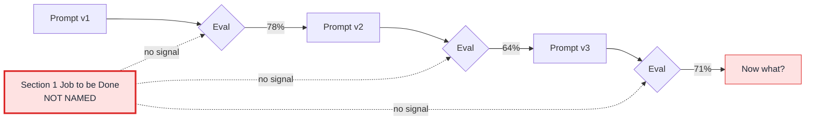

# You don't have a prompt problem. You have a Section 1 problem.

Six weeks into building an AI feature, the team is rewriting the system prompt for the fifth time. Eval scores keep jumping — 78% one week, 64% the next, 71% the one after. The team is exhausted. The model isn't the issue. The prompt isn't the issue.

What's missing is upstream of the prompt entirely.

The team never wrote down the user's actual job. Not the agent's job — the user's. *"The agent helps with onboarding queries"* is the agent's task. The user's job is something specific: *"reach my first successful action in the product without ever opening support, and feel like the company knew what it was doing."*

Different sentence. Different success threshold. Different acceptable failure modes. Different eval criteria.

When the user's job is named at that level of specificity, every prompt change becomes testable. Did this change move the team closer to that job, or further from it? You can run an eval against the answer. You can ship the change with conviction. You can argue the result with data instead of opinions.

When the user's job is *not* named — and in most teams, it isn't — every prompt change is a vibes change. Someone reads the agent's output and says *"this feels better."* Someone else reads it and says *"this feels worse."* Three weeks later, the prompt has been rewritten five times, and the eval scores are still jumping. The team thinks it's iterating. It's actually thrashing.

This is why teams plateau on prompt engineering. They are not bad at prompts. They are missing the layer above prompts.

That layer is [Section 1 of the agent spec](../frameworks/ai-agent-product-spec.md#1-job-to-be-done): *Job to Be Done.* The user's actual job, named in a single sentence with a specific outcome. If you can't write that sentence — or if everyone on the team would write a different one — the rest of the spec will rot, and so will every prompt iteration on top of it.

So when a team tells me their prompt isn't working, the first question isn't *what does the prompt say?* It's *what's the user trying to do, exactly?* The answer comes back, almost every time, as some version of *"we hadn't pinned that down."*

That is the answer.

**If you've rewritten the prompt five times and the scores aren't moving, you don't have a prompt problem. You have a Section 1 problem. Fix the job before you touch the prompt again.**
