# Sunset criteria aren't a kill switch. They're a portfolio strategy.

Most PMs read [Section 7 of the agent product spec](../frameworks/ai-agent-product-spec.md#7-sunset-criteria) — *Sunset Criteria* — as the worst-case section. The part that exists in case the agent fails. The kill switch. The bad-news paragraph nobody wants to think about at launch.

It is actually the opposite. Sunset criteria are the single biggest portfolio-allocation tool a PM has. The teams that write them at launch run circles around the teams that do not — not because they kill more agents, but because they choose better ones to keep.

Here is the version of the move most PMs do not see.

A team has, say, eight agents in production. If they are honest, four of those really matter. Two are borderline. Two are quietly running, quietly costing money, quietly pulling engineering attention every time something breaks. The team knows which is which. Everyone knows.

Without sunset criteria, all eight have an equal claim on the roadmap forever. The PM cannot propose retiring the two quiet ones, because there is no agreed-upon threshold for retirement. Any sunset proposal becomes a political fight: someone built the agent, someone champions it, no objective criterion exists to settle the argument. So the team carries all eight, and the four real winners get less attention than they deserve.

With sunset criteria written into each spec at launch, the conversation changes shape. *"This agent's resolution rate has been below 60% for three quarters. The spec says we sunset at that threshold. We're retiring it next sprint."* No politics. No champion fight. No litigation. The criterion fires the way the spec said it would.

What happens next is the actual unlock. The engineering and PM capacity that was tied up in two retired agents opens up. The four winners get more of it. The two borderline agents get a real shot at the winner column because they are no longer competing with dead weight. By the following quarter, the team is shipping new agents on top, on a base that compounds instead of accumulates.

The sunset did not kill anything that was working. It freed capacity from things that were not.

```mermaid
flowchart LR
    subgraph before ["Without sunset criteria"]
        direction TB
        B1[Winner 1]
        B2[Winner 2]
        B3[Winner 3]
        B4[Winner 4]
        B5[Borderline]
        B6[Borderline]
        B7[Dead weight]
        B8[Dead weight]
    end

    subgraph after ["With sunset criteria firing"]
        direction TB
        A1[Winner 1+]
        A2[Winner 2+]
        A3[Winner 3+]
        A4[Winner 4+]
        N1[New Agent 9]
        N2[New Agent 10]
    end

    before -->|2 retired<br/>4 borderline absorbed<br/>capacity freed| after

    style before fill:#f3f4f6,stroke:#6b7280
    style after fill:#dcfce7,stroke:#16a34a
```

This is what most PMs miss when they write Section 7 like a hazard warning. The kill switch *is* the portfolio strategy. A team without sunset criteria has implicitly committed to running every agent it ever ships, forever — which means every new agent slows the next one down. A team with sunset criteria is a team that can choose. And choice is the only thing that lets a portfolio actually compound.

**A spec without sunset criteria assumes you will never have to choose. Specs that include them are how a PM tells the team: we are a portfolio, not a graveyard.**
