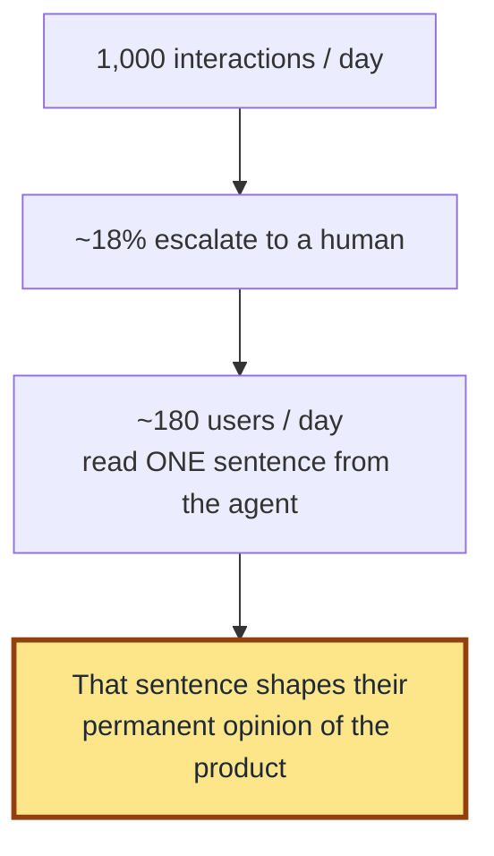

# The single most overlooked line in an agent spec

The single most overlooked line in an agent spec: the exact words the agent uses when it hands off to a human.

I've read dozens of agent specs from real teams. Most cover *when* the agent should defer to a human — the trigger conditions, the escalation logic, the routing rules. Almost none cover *how*. The wording. The actual sentence.

That sentence is the highest-impact UI in the entire agent. Here is why.

Imagine an agent handling a thousand interactions a day. Say 18% escalate to a human — call it 180 handoffs daily. Every one of those users reads one sentence from the agent before they reach the human. One sentence. From every escalated session. That sentence has more reach than the agent's welcome screen, your in-app tooltips, your help center, and most of your onboarding combined. It is also the moment the user is most likely to form a permanent opinion about whether the agent is helpful or wasting their time.

And in most teams, nobody wrote it.

What is there instead is whatever the model decides to say in the moment. *"I'm sorry, I'm unable to help with that. Let me connect you to a human."* On a worse day: *"This is outside my current capabilities."* Generic. Apologetic. Forgettable.

A handoff sentence specified on purpose is different. It does three jobs in fewer words than the default:

- It tells the user *why* the handoff is happening — not "I can't help" but "this case needs a human because it involves a refund above the auto-approval limit."
- It tells the user *what is about to happen* — "you'll be routed to a billing specialist; the typical wait is under four minutes."
- It carries the agent's posture from the conversation that preceded it — confident if the agent has been confident, careful if the agent has been careful.

This is the line that decides whether the user feels *routed* or *rejected.* It is also the line PMs delegate to engineering most often — because it lives inside the system prompt and the spec never had a section that caught it.

In the seven-section agent product spec, the handoff sentence belongs inside [Section 3](../frameworks/ai-agent-product-spec.md#3-decision-boundary): the decision boundary. Most teams write Section 3 as a list of conditions. *When X, defer.* That is half the section. The other half is the language the user actually hears when the deferral fires.

**A spec that names the trigger but not the wording has a hole in the most-read line of the product. Write the handoff sentence on purpose, or the model will — every time, in a voice you did not choose.**
