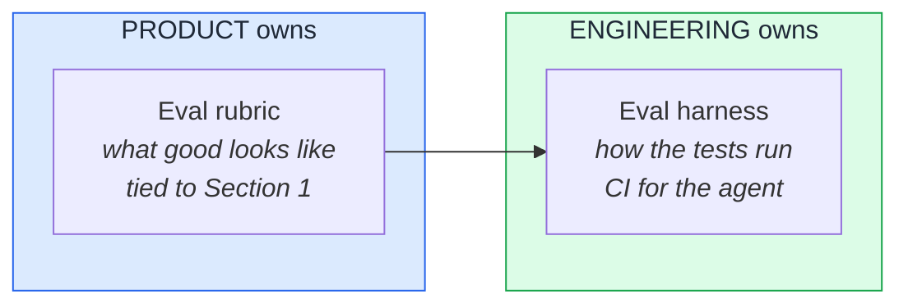

# If engineering owns your agent's eval suite, engineering owns your product

There is a pattern I see in maybe half the AI teams I talk to.

The PM writes the agent spec. Hands it to engineering. Engineering builds the eval suite. Engineering decides what scores look good. Engineering decides when to merge a prompt change. Six months later, the PM does not quite recognize the agent that is in production.

The PM did not lose control because the spec was unclear. The PM lost control because the eval got delegated.

The eval suite is where product decisions get adjudicated. Every prompt change, every model swap, every tool addition runs through it. If the change clears the bar, it ships. If it does not, it does not. Whoever defines the bar defines the product.

That definition should not belong to engineering. Not because engineering is incapable — engineering is more than capable — but because the *criteria* are a product question, not a technical one.

Here is what the delegated version looks like in practice. A team I observed had an eval suite that scored exactly one thing: *did the agent say anything unsafe?* If no, the change shipped. That is a safety check. It is necessary. It is not an eval.

The PM had not written down what *good* looked like at the user-job level — only what *bad* looked like — so engineering built a floor. The agent's performance settled exactly at that floor, because the system was optimized against it. The team thought the agent was stable. It was actually capped.

What the PM should have written: a scoring rubric tied to the user's actual job. *Did the agent resolve the case in fewer than two turns? Did the user complete the workflow without escalation? Did the answer reference the user's plan tier when it should have?* Those are product criteria. The harness that runs them is engineering. The rubric they run against is product.

This is [Section 5 of the seven-section agent spec](../frameworks/ai-agent-product-spec.md#5-evaluation-criteria) — *Evaluation Criteria.* Most teams treat it as the most technical section, which is why most teams hand it over. It is actually the most product-shaped section in the entire spec. It is where the PM tells the agent what *winning* looks like.

If the PM does not write it, engineering will write it for them. And engineering will write the version they can build and ship to — not the version that matches what the user came to your product to do. That is not a failure of engineering. It is a failure of any PM who treats the eval as someone else's surface.

**You do not need to write the eval harness. You need to write the eval rubric. The harness is engineering. The rubric is product. Delegate the first; keep the second.**
